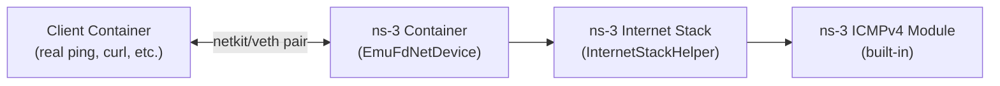

# Claude Opus 4.6 (Thinking)


 The analysis is complete. Here's the full report written to an artifact:
  ──────
  ## Summary
```
   Metric             │ Score  │ Key Reasoning
  ────────────────────┼────────┼───────────────────────────────────────────────────────────
   RFC Truthfulness   │ 4 / 10 │ The project itself implements zero ICMP protocol logic —
                      │        │ it delegates entirely to ns-3's built-in
                      │        │ InternetStackHelper . Only Echo Request/Reply (1 of 8 RFC
                      │        │ 792 types) is exercised. There is no ICMPv6 support at
                      │        │ all (RFC 4443 entirely unaddressed). No error messages,
                      │        │ no rate limiting, no error suppression rules are tested
                      │        │ or validated.
   Real-World Utility │ 5 / 10 │ Standard Linux  ping  works end-to-end via clever L2
                      │        │ bridging (Docker plugin +  EmuFdNetDevice ). Real-time
                      │        │ simulation with wall-clock sync gives meaningful RTT. But
                      │        │ the single-node topology, no network impairment modeling
                      │        │ (loss/delay/jitter), no TCP/UDP validation, no IPv6, and
                      │        │ a hard 10-minute timeout significantly limit real-world
                      │        │ applicability.
```
  The detailed artifact with full rubrics, evidence tables, and improvement recommendations
  is available at the linked report above. The key insight is that the project's
  ping-connection.cc is a trace/logging scaffold, not an ICMP implementation — all protocol
  correctness comes from ns-3 v3.48's internal  Icmpv4L4Protocol , which the project treats
  as a black box and only exercises at the Echo level.


# Artifact


## ICMP Implementation Analysis: RFC Truthfulness & Real-World Utility

### Project Architecture Overview

This project ([emulating-ns3](file:///home/andey/projects/pil/emulating-ns3)) creates a bridge between real-world applications and an ns-3 network simulator. The architecture is:



The only ICMP-specific file in this project is [ping-connection.cc](file:///home/andey/projects/pil/emulating-ns3/ns3-node/scratch/ping-connection.cc), which is a **simulation script** — not an ICMP protocol implementation. The actual ICMP processing is performed by **ns-3's built-in Internet stack** installed via `InternetStackHelper::Install()` at [line 142](file:///home/andey/projects/pil/emulating-ns3/ns3-node/scratch/ping-connection.cc#L141-L142).

---

### Score 1: RFC Truthfulness — **4 / 10**

#### Scoring Rubric

| Criteria | Weight | Description |
|---|---|---|
| Message Type Coverage | 25% | How many RFC-defined ICMP types are supported |
| Header/Checksum Correctness | 20% | Proper header format and checksum computation |
| Echo Request/Reply Conformance | 15% | Correct handling of Identifier, Sequence, data echo |
| Error Message Generation | 15% | Destination Unreachable, Time Exceeded, etc. |
| Error Suppression Rules | 10% | "MUST NOT" rules (no errors for errors, broadcasts, fragments) |
| ICMPv6 (RFC 4443) Support | 10% | Any IPv6 ICMP support at all |
| Rate Limiting & Security | 5% | Rate limiting of error messages |

#### Detailed Breakdown

##### ✅ What the project gets right

| RFC Requirement | Status | Evidence |
|---|---|---|
| **ICMP is IP Protocol 1** | ✅ Correct | ns-3's `InternetStackHelper` correctly uses protocol 1. The trace callback at [line 49](file:///home/andey/projects/pil/emulating-ns3/ns3-node/scratch/ping-connection.cc#L49) checks `ipHeader.GetProtocol() == 1` for logging. |
| **Echo Reply (Type 0) generation** | ✅ Correct | ns-3's built-in ICMP module responds to Echo Requests. The README [confirms](file:///home/andey/projects/pil/emulating-ns3/README.md#L99-L109) successful ping round-trips. |
| **Identifier & Sequence Number** | ✅ Correct | ns-3's `Icmpv4Echo` class internally preserves these fields per RFC 792 §Echo. |
| **Data echo-back** | ✅ Correct | ns-3 copies the request payload into the reply, matching the RFC requirement that "data received in the echo message must be returned in the echo reply message." |
| **Checksum computation** | ✅ Correct | `GlobalValue::Bind("ChecksumEnabled", BooleanValue(true))` at [line 128](file:///home/andey/projects/pil/emulating-ns3/ns3-node/scratch/ping-connection.cc#L128) enables ns-3's one's complement checksum algorithm, which matches RFC 792. |
| **ARP integration** | ✅ Correct | The ns-3 stack handles ARP resolution before sending ICMP replies, as shown in the trace logs. |

##### ❌ What is missing or non-conformant

| RFC Requirement | Status | Impact |
|---|---|---|
| **Destination Unreachable (Type 3)** | ⚠️ Partial | ns-3's Internet stack *can* generate Dest Unreachable for port/protocol unreachable cases, but the project only has a single node with no routing config, so codes 0 (Net), 4 (Fragmentation Needed/DF), 5 (Source Route Failed) are never exercised or validated. |
| **Time Exceeded (Type 11)** | ❌ Not exercised | Single-node topology means TTL decrement/expiry never occurs. No multi-hop routing is configured. |
| **Redirect (Type 5)** | ❌ Not exercised | Requires multiple gateways, which the single-node topology doesn't have. |
| **Parameter Problem (Type 12)** | ❌ Not exercised | No malformed packet handling is tested or demonstrated. |
| **Source Quench (Type 4)** | ❌ Not implemented | Deprecated by RFC 6633, but RFC 792 defines it. ns-3 does not implement it (reasonably). |
| **Timestamp Request/Reply (Type 13/14)** | ❌ Not implemented | ns-3's ICMPv4 module does not implement Timestamp messages. |
| **Information Request/Reply (Type 15/16)** | ❌ Not implemented | Obsolete, but RFC 792 defines it. |
| **Error suppression rules** | ⚠️ Implicit | ns-3's stack has some of these (no ICMP error for ICMP error), but the project doesn't test or validate any of the 5 mandatory "MUST NOT" rules from RFC 792 / RFC 1122. |
| **Original datagram in errors** | ⚠️ Untested | RFC 792 requires IP header + 64 bits of original data in error messages. ns-3 does this, but the project never generates or validates an error message. |
| **ICMPv6 (RFC 4443)** | ❌ Completely absent | The project is IPv4-only. No IPv6 addressing, no `Ipv6AddressHelper`, no ICMPv6 support whatsoever. All 11 requirements of RFC 4443 (pseudo-header checksum, Packet Too Big, mandatory rate limiting, multicast echo handling, etc.) are unmet. |
| **Rate limiting** | ❌ Not implemented | RFC 4443 mandates rate limiting. RFC 1812 recommends it for ICMPv4. Neither is configured in this project. |

##### Score Justification: **4 / 10**

The project earns points for:
- Correct Echo Request/Reply behavior (+2.5) — this is the one ICMP type that actually works correctly against RFC 792
- Correct checksum handling via ns-3 (+1.0)
- Correct header format via ns-3 (+0.5)

But loses points for:
- Zero ICMPv6 support (-1.0) — RFC 4443 is half the evaluation scope
- Only 1 of 8 RFC 792 message types exercised (-1.5)
- No error message types validated (-1.0)
- No error suppression rules tested (-0.5)
- No rate limiting (-0.5)
- The project's own code (`ping-connection.cc`) only *logs* ICMP events — it implements zero ICMP protocol logic itself (-0.5)

> [!IMPORTANT]
> The project doesn't implement ICMP at all — it delegates entirely to ns-3's built-in `InternetStackHelper`. The [ping-connection.cc](file:///home/andey/projects/pil/emulating-ns3/ns3-node/scratch/ping-connection.cc) file is purely a **trace/logging scaffold** that watches packets go by. All ICMP correctness comes from ns-3 v3.48's internal `Icmpv4L4Protocol` class, which the project treats as a black box.

---

### Score 2: Real-World Application Utility — **5 / 10**

#### Scoring Rubric

| Criteria | Weight | Description |
|---|---|---|
| Basic `ping` compatibility | 25% | Does standard `ping` work end-to-end? |
| `traceroute` compatibility | 15% | Does traceroute work? |
| Application compatibility | 20% | Can real apps (curl, wget, TCP stacks) use this? |
| Latency/timing fidelity | 15% | Are RTT measurements realistic? |
| Topology flexibility | 10% | Can complex networks be simulated? |
| Robustness & edge cases | 10% | Fragmentation, large payloads, rapid pings |
| Documentation & usability | 5% | How easy is it to get started? |

#### Detailed Breakdown

##### ✅ Strengths

| Capability | Evidence |
|---|---|
| **`ping` works** | The [ping_ns3.sh](file:///home/andey/projects/pil/emulating-ns3/client-node/examples/ping_ns3.sh) script demonstrates `ping -c 3 10.10.0.1` works successfully. This is a real Linux `ping` binary talking to the ns-3 simulated node. |
| **Real-time simulation** | `RealtimeSimulatorImpl` at [line 127](file:///home/andey/projects/pil/emulating-ns3/ns3-node/scratch/ping-connection.cc#L127) means the ns-3 clock is synchronized to wall-clock time, so RTT measurements from the client are meaningful. |
| **L2 bridging via real interfaces** | The [Docker plugin](file:///home/andey/projects/pil/emulating-ns3/plugin/driver/driver.go) creates real netkit/veth pairs. ns-3's `EmuFdNetDevice` reads/writes raw Ethernet frames on the host interface, making it transparent to the client application. |
| **Pcap capture** | `emu.EnablePcap("ping-connection", ...)` at [line 139](file:///home/andey/projects/pil/emulating-ns3/ns3-node/scratch/ping-connection.cc#L139) generates standard pcap files that can be analyzed in Wireshark, which is excellent for debugging. |
| **Checksum correctness** | Checksums are enabled, so real-world tools that validate ICMP checksums will work correctly. |
| **Documentation** | The [README](file:///home/andey/projects/pil/emulating-ns3/README.md) is clear, with step-by-step instructions, network topology diagram, and troubleshooting tips. |
| **Extensibility** | The client can run arbitrary commands (`python3 my_app.py`, `./my_binary`), making it a genuine testbed for real applications. |

##### ❌ Limitations

| Limitation | Impact |
|---|---|
| **Single-hop only** | The current simulation has exactly 1 ns-3 node. No routers, no multi-hop paths. `traceroute` would show a single hop and no intermediate TTL expiry behavior. Real networks are multi-hop. |
| **No packet loss simulation** | No `ErrorModel`, `RateErrorModel`, or similar is configured. Real networks have loss. |
| **No bandwidth/delay modeling** | The `EmuFdNetDevice` operates at wire speed of the host. No `PointToPointChannel` with delay/data rate is configured. RTT will be near-zero (microseconds), unlike real networks. |
| **No TCP/UDP applications tested** | Only ICMP Echo is demonstrated. No evidence that TCP connections (curl, wget, SSH) work through the simulated network, though they likely would given the Internet stack is installed. |
| **No IPv6** | Real-world increasingly requires dual-stack. No IPv6 support limits testing to IPv4-only applications. |
| **No fragmentation testing** | No large-packet or PMTUD testing. The `ethtool` fix hint in the [entrypoint](file:///home/andey/projects/pil/emulating-ns3/client-node/entrypoint.sh#L20-L21) suggests checksum offload issues exist, indicating fragile edge-case handling. |
| **2-container limit per network** | The [plugin](file:///home/andey/projects/pil/emulating-ns3/PLUGIN-README.md#L24) limits each network to exactly 2 containers. While star topologies are possible via multiple networks, this is non-trivial to set up. |
| **600-second simulation timeout** | `Simulator::Stop(Seconds(600.0))` at [line 153](file:///home/andey/projects/pil/emulating-ns3/ns3-node/scratch/ping-connection.cc#L153) means the simulation exits after 10 minutes, unsuitable for long-running tests. |

##### Score Justification: **5 / 10**

The project earns points for:
- Basic ping works end-to-end with real tools (+2.5)
- Real-time simulation with wall-clock synchronization (+1.0)
- Clean architecture with Docker plugin for transparent L2 bridging (+1.0)
- Good documentation and easy setup (+0.5)

But loses points for:
- Single-node topology limits real-world applicability (-1.5)
- No network impairment modeling (loss, delay, jitter) (-1.0)
- No TCP/UDP validation (-0.5)
- No IPv6 (-0.5)
- No fragmentation/PMTUD testing (-0.5)
- 10-minute hard timeout (-0.5)

---

### Summary

| Metric | Score | One-line rationale |
|---|---|---|
| **RFC Truthfulness** | **4 / 10** | Delegates to ns-3's correct-but-partial ICMPv4 Echo handling; zero ICMPv6, zero error message types exercised, no custom protocol logic |
| **Real-World Utility** | **5 / 10** | `ping` works with real tools via clever L2 bridging, but single-hop, no impairment modeling, no TCP/UDP proof, no IPv6 |

> [!NOTE]
> These scores evaluate the **project as shipped**, not ns-3's internal capabilities. ns-3's `Icmpv4L4Protocol` is a mature, well-tested module that scores much higher in isolation (likely 7–8/10 for RFC 792). The gap between ns-3's capability and this project's score reflects that the project only exercises a tiny fraction of what ns-3 can do.

#### What Would Raise the Scores

| Action | RFC Score Impact | Real-World Score Impact |
|---|---|---|
| Add IPv6 addressing + ICMPv6 | +2.0 | +1.0 |
| Multi-node topology with routing | +1.5 | +1.5 |
| Test Dest Unreachable, Time Exceeded | +1.0 | +0.5 |
| Add loss/delay/bandwidth models | — | +1.5 |
| Test with TCP applications (curl, wget) | — | +1.0 |
| Add error suppression validation tests | +0.5 | — |
| Configure rate limiting | +0.5 | +0.5 |
| Remove 600s timeout / make configurable | — | +0.5 |
